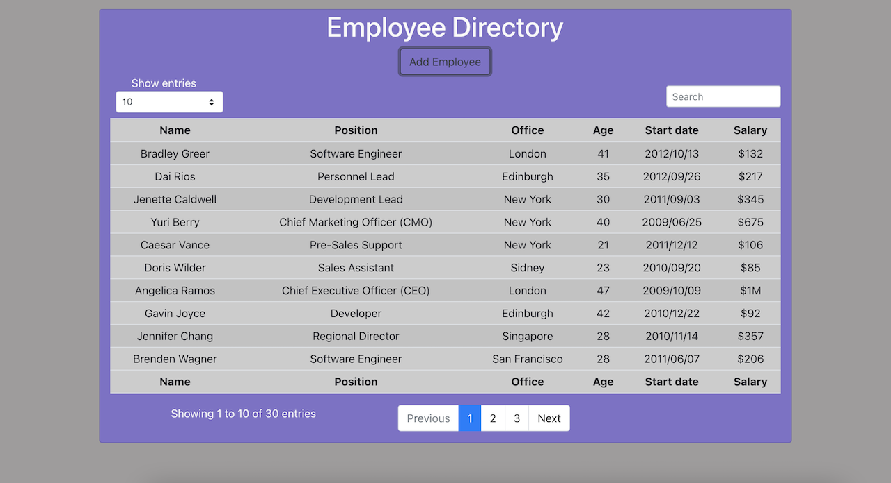
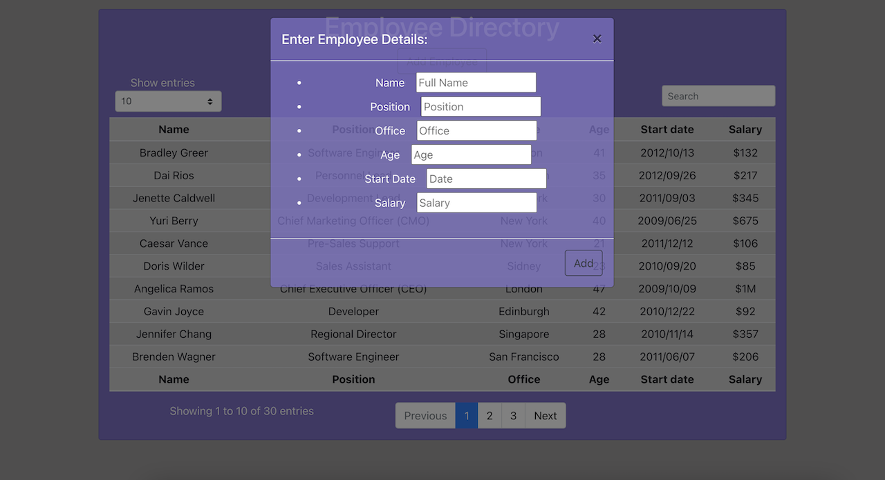

# Employee Directory

Link to deployed site: [Employee Directory](https://calm-crag-68916.herokuapp.com/)

## Description
Asked to build a React App so the user can view an employee directory containing non-sensitive information about their employees. The user can sort the tables and filter the tables to find specific information about an employee.

## How it works
    1. Open the application
    2. Find the employee directory
    3. Search to filter employees
    4. Sort the tables by numbers of employees shown
    5. Click 'Add Employee' to add a new empoyee to the table

## App Images
Home Page

Modal

## Credits Technologies
    1. HTML
    2. CSS
    3. JavaScript
    4. Node.js
    5. React.js
    6. Bootstrap
    7. MDBootstrap